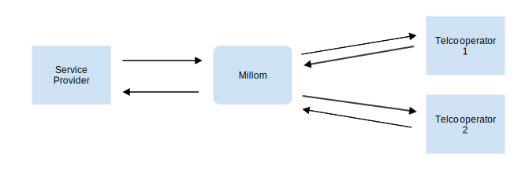
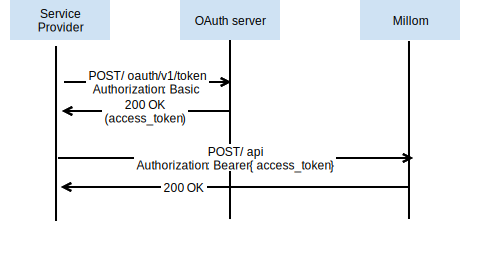

# Millom APIs
This repo hosts the APIs specifications for working with Telenor's [Millom](https://millom.com/) platform.
Millom is middleware exposing telco capabilities to third party Internet channels.
Millom's APIs allow authorized clients to retrieve current subscription balance, 
a list of relevant offers, and activating one of the provided offers.

Notifications can also be sent to service providers on events in the telco stack, 
e.g. when user is about to run out of data or a purchase has been activated.  

---
## Prerequisites
All API requests to Millom must be authenticated with [OAuth 2.0 client credentials](https://oauth.net/2/grant-types/client-credentials/) access token. 
The access token should be cached and reused until (almost) expiry.
Contact Millom for agreements and credentials.  

---

Millom's APIs will generally reference end-user by two keys, the idValue and idType.

| idTYpe | idValue | Description |
| ------- | ------ | ----------- |
| MSISDN | 475551234 | The users mobile number, on full E.164 form including country code |
| CPID   | abcd1234 | An anonymized token (a base 64 coded string) representing the user | 

---
## APIs
Millom has APIs for service providers and telco operators.

| Service Providers | Operators |
| ------ | ----------- |
| [Upsell API](apis/service-providers) | [Operator backend integration](apis/operators/backend) | 
| | [Notification API](apis/operators/notification) |
| | [Purchase callback API](apis/operators/purchase-callback) |